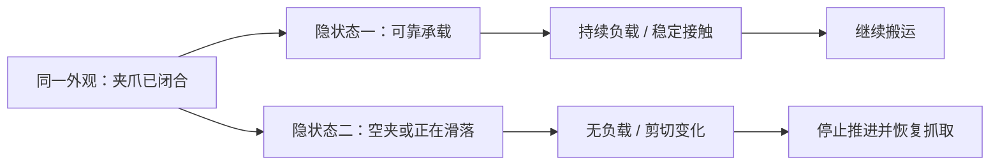
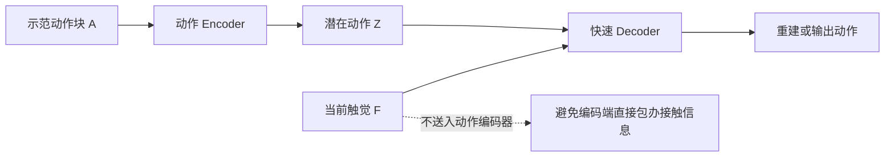
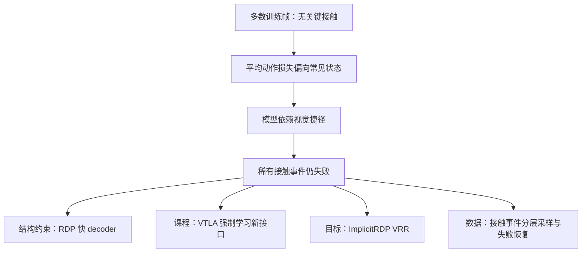

# 触觉机器人学习全景：感知、表征、闭环与 VLA

入口：[[论文知识库]] · 配套：[[VLA 全景综述：技术脉络、前沿与研究地图]]

已有精读：[[T-Rex]] · [[FTP-1]] · [[N0-VTLA]] · [[N0-TWAM]]  
已有专题：[[触觉机器人学习]] · [[触觉 VLA 方法比较]] · [[预测触觉与观测触觉]]

> [!abstract] 一句话地图
> 触觉不是“又一路相机”，而是机器人进入接触后获得的局部物理证据。这个领域有四个不同难题：**测得准、跨硬件读得懂、来得及改动作、能预见接触后果**。Sparsh/T3、FTP-1、RDP/T-Rex、N0 各自主要解决其中不同的部分。

本篇检索截止 **2026-09-09**。经典表与新增前沿条目多为第一手导航级核验；RDP、T-Rex 本次复核全文及附录，FTP-1/N0 的深入机制沿用你的既有精读，并交叉检查官方项目入口。没有把所有候选论文伪标成已精读，也没有独立复现实验。

## 1. 为什么“看得清”仍然不够

想象机械臂插 USB：外部图像里两个状态几乎一样——插头已经入孔，或者顶在孔沿。前者可以继续，后者继续用力会卡住。再想象抓软瓶：闭爪位置相同，可能刚好夹稳，也可能已压瘪。视觉给几何和语义，触觉提供接触位置、载荷、剪切、滑移、局部变形等补充信息；本体状态给机器人自身运动，三者不能互相简单替代。



*教学示意图，非论文图。* 允许的逻辑是“新触觉证据改变对隐状态的判断，再改变动作”。失败路径是只按夹爪闭合命令认定抓取完成；控制命令是意图，不是物理结果。

### 1.1 两个领域怎么接起来

| 层次 | 真正问题 | 代表路线 | 与 VLA 的关系 |
|---|---|---|---|
| 硬件 / 物理测量 | 感知接触的哪些维度、覆盖哪些表面？ | GelSight、DIGIT、ReSkin / AnySkin、阵列皮肤 | 决定策略能观测到什么，不是模型后处理能凭空补出的信息 |
| 表征 | 各种原始触觉怎样形成可迁移特征？ | Sparsh、T3、AnyTouch、TacX | 可做 VLA 的感知前端，不等于已经有动作策略 |
| 几何融合 | 局部接触怎样与全局物体/机器人位置对齐？ | 3D-ViTac、3D policy + touch | 适合 3D vision 背景切入 |
| 快速闭环 | 新接触能否在旧 chunk 执行完之前改变动作？ | RDP、FoAR、ImplicitRDP、T-Rex | 解决推理/反馈带宽，不只增加输入维度 |
| 通用 VTLA | 多传感器、多任务数据如何联合训练？ | FTP-1、Tactile-VLA、N0-VTLA | 连接语义任务、触觉与动作 |
| 预测 / WAM | 能否预期接触、识别阶段并提前调整？ | ViTacFormer、N0-TWAM | 增加未来信息目标，但必须保留真实反馈来校正 |

## 2. 先补必要的物理概念

### 2.1 不同“触觉”究竟测什么

| 表示 | 典型维度 / 内容 | 优势 | 丢失或混入的信息 |
|---|---|---|---|
| 腕部六维力/力矩 | $[F_x,F_y,F_z,\tau_x,\tau_y,\tau_z]$ | 紧凑，适合负载与接触控制 | 多个接触贡献叠加，可能混入重力/惯性；不直接提供逐指空间分布 |
| 指尖净力 / wrench | 每指若干力与力矩通道 | 易接入快速策略 | 相同合力可能对应不同接触位置与滑移模式 |
| 压力阵列 | 表面多个 taxel | 接触分布与覆盖度较直接 | 是否测剪切取决于硬件；不可把法向压力说成完整三维力 |
| 光学触觉图像 | 内部相机观察弹性层形变/纹理 | 高分辨率局部接触几何 | 像素不是牛顿；照明、胶体、安装、磨损会变 |
| marker displacement | 标记点二维位移场 | 可反映剪切、形变变化 | 不能未经标定直接称为三维力场 |
| 学习 latent / token | 任务相关压缩表征 | 便于多模态与跨传感器接口 | 相同 shape 不保证相同物理语义；可能丢失精细事件 |

光学触觉内部确实使用相机，但它观察的是与环境发生物理接触的弹性体，而不是远处场景。与外部 RGB 的差别来自测量过程，不只是图像域风格不同。[GelSight](https://arxiv.org/abs/1708.00922)、[DIGIT](https://arxiv.org/abs/2005.14679)、[AnySkin](https://any-skin.github.io/)

### 2.2 三个最小公式，以及它们的边界

**摩擦与滑移**：简单库仑接触近似下，切向力满足 $\|f_t\|\leq\mu f_n$ 才可能保持静摩擦。教学例：若 $\mu=0.5$、$f_n=2N$，理想切向承载上限约 $1N$。这不是某篇论文配置，也不是通用抓取控制律；真实软指接触还涉及力矩、接触面积、材料和动态过程。增大夹力可防滑，却可能压坏物体。

**阻抗与导纳**：阻抗规定“偏离目标位姿时产生怎样的力”，导纳规定“感到外力后允许怎样的运动”。在一维准静态弹簧教学模型中，$F=K(x_d-x)$；改变虚拟目标 $x_d$ 会改变接触力，因而“预测位置目标”也可能实现顺应，但前提是下层控制和刚度已定义。

**有效反馈延迟**：

$$d_{\rm total}=d_{\rm sensing}+d_{\rm transport}+d_{\rm inference}+d_{\rm queue}+d_{\rm actuation}.$$

高帧率传感器只缩短其中一项。若触觉已到达却必须等旧 chunk 全部执行，排队项仍很大。相关控制与运动学基础可系统看 [MIT Manipulation](https://manipulation.mit.edu/) 和 [Modern Robotics](https://modernrobotics.northwestern.edu/)。

### 2.3 实验前应该能解释的词

- **Contact onset / release**：接触开始与释放，常是任务阶段边界；噪声阈值不应直接当真值。
- **Slip / incipient slip**：已经滑动与局部滑移前兆；一个力幅值不一定区分两者。
- **Force closure / grasp stability**：在假设的接触模型下能抵抗扰动，不是“一次演示没掉”。
- **Hysteresis / drift / wear**：加载卸载路径不同、基线漂移、胶体磨损；训练集里的同一物体不代表传感器分布不变。
- **Active touch**：为了减少不确定性而选择接触动作，不只是被动接收触觉；要扣除时间、力和损伤代价。
- **Cross-instance / cross-sensor / cross-embodiment**：换同型号实例、换传感原理/型号、换机器人形态，难度和证据要求不同。

## 3. 经典到前沿：有选择地补齐研究谱系

### 3.1 传感器、表示与仿真

| 论文 / 发表口径 | 核心闪光点 | 它留下的下一问 |
|---|---|---|
| [GelSight: Improved Tactile Sensing…](https://arxiv.org/abs/1708.00922)，2017 原文入口 | 将接触几何/滑移转成可观测的高分辨率光学信号 | 怎样把图像变成物理量，并在换胶体后保持可靠？ |
| [DIGIT](https://arxiv.org/abs/2005.14679)，RA-L 2020 | 紧凑、可复现的视触觉硬件 | 小型化之外，耐用性、覆盖度与控制闭环怎样权衡？ |
| [TACTO](https://arxiv.org/abs/2012.08456)，RA-L 2022 | 可扩展触觉图像仿真渲染 | 渲染真实不保证接触动力学真实；当前仓库已归档 |
| [Rotating without Seeing](https://roboticsproceedings.org/rss19/p036.html)，RSS 2023 | 依赖触觉的手内旋转与 sim-to-real，提示低维触觉也可有力 | 高分辨率不是唯一价值，空间覆盖和任务需求同样关键 |
| [General-Purpose Sim2Real Protocol…](https://callmeray.github.io/tactile_sim2real_page/)，**T-RO 2024** | 面向 marker-based visuotactile 的接触操作迁移协议 | 应评估材料/传感器参数分布与真实动力学误差；DOI: 10.1109/TRO.2024.3352969 |
| [Sparsh](https://proceedings.mlr.press/v270/higuera25a.html)，CoRL 2024；论文集 2025 | 自监督触觉表征与 TacBench | 感知 probe 高分能否转成动作数据效率和闭环收益？ |
| [T3](https://proceedings.mlr.press/v270/zhao25c.html)，CoRL 2024；论文集 2025 | 用统一模型体系承接多种触觉传感器与任务 | 哪部分应共享、哪部分仍须传感器专属适配？ |
| [3D-ViTac](https://proceedings.mlr.press/v270/huang25e.html)，CoRL 2024；论文集 2025 | 将视觉和触觉信息放进统一 3D 表示服务 manipulation | 几何统一需要标定；表示统一不等于自动解决快速反馈 |
| [AnySkin](https://arxiv.org/abs/2409.08276)，2024 初稿 | 磁式皮肤可替换、跨实例复用 | 一种传感器换实例的成功，不等于跨任意传感原理 |
| [AnyTouch](https://arxiv.org/abs/2502.12191)，2025 初稿 | 通用光学触觉表示路线 | 静态材质/对象知识与动态接触控制是否一致？ |
| [TacX / Tactile Beyond Pixels](https://proceedings.mlr.press/v305/higuera25a.html)，CoRL 2025 | 多感官触觉表示，不只依赖像素 | 每种新增模态是否带来独立控制信息？ |
| [AnyTouch 2](https://arxiv.org/abs/2602.09617)，2026-02；arXiv 标注 ICLR 2026 | ToucHD 与动态、力相关触觉表示 | 动态预测是否保留动作真正需要的剪切、接触变化？ |

上表是导航级；选择一篇精读时，再补原图、实验任务、训练/测试传感器划分和代码版本。硬件论文、表征论文、策略论文不应放进同一个“成功率排行榜”。

### 3.2 你已读的 HyVLA 其实也有一个触觉入口

HyVLA v2 的 Sec. 6.2 / PDF 第 16 页报告了定性的力辨别实验：给 action expert 增加处理双手 F/T 历史的轻量编码器，依靠抓取时的力信号选出较轻盒子。它证明采集系统里的非视觉信号可以服务下游任务，但不是全文主干已经具备通用触觉控制的证据，也不能当成 T-Rex 式高频反应测试。[HyVLA 原文](https://arxiv.org/abs/2606.14409v2)

### 3.3 从触觉 policy 到 VTLA / WAM

| 工作 | 主要问题 | 最值得与谁对照 |
|---|---|---|
| [RDP](https://www.roboticsproceedings.org/rss21/p052.html)，RSS 2025 | 低频 diffusion chunk 难应对快速接触变化 | 普通 DP + touch、ImplicitRDP、T-Rex |
| [FoAR](https://tonyfang.net/FoAR/)，2024 初稿 | 接触相关时段的力感知反应与融合 | 一直融合力 vs 接触门控；看是否在非接触时引入噪声 |
| [ViTacFormer](https://arxiv.org/abs/2506.15953)，2025 初稿 / 2026-05 v2 | 视觉触觉跨模态表示 + 未来触觉预测 | 只用当前触觉、只加辅助预测、不改变动作生成接口 |
| [Tactile-VLA](https://arxiv.org/abs/2507.09160)，2025 初稿 | VLM 物理语义与触觉、混合位置/力控制连接 | 纯拼 token 的 VLA；收益来自推理还是下层控制器？ |
| [ImplicitRDP](https://implicit-rdp.github.io/)，RA-L 2026（官方项目页） | 单网络结构化快慢学习与防模态忽略 | RDP 显式两级、原始力预测辅助目标 |
| [FTP-1](https://ftp1-policy.github.io/)，2026-06 预印本 | 异构触觉数据与通用动作训练 | Sparsh/T3 的 encoder 统一 vs policy 统一 |
| [T-Rex](https://tactile-rex.github.io/)，2026-06 预印本 | 大模型慢规划与快触觉动作细化 | RDP 的 latent decoder、RTC 的时间衔接 |
| [N0-VTLA](https://research.neoteai.com/n0-vtla/)，2026-07 技术论文 | 紧凑未来触觉 token 与离线经验改进 | current-only、future latent、ALTER 独立收益 |
| [N0-TWAM](https://research.neoteai.com/n0-twam/)，2026-07 技术报告 | 联合预测未来视觉/触觉，再生成动作；真实触觉另路纠偏 | VTLA 压缩预测 vs WAM 生成；predicted / observed 双路径 |

> [!note] 这里并不存在一条所有方法都认可的终点
> 小型高频力策略、通用触觉表征、大型 VTLA、世界动作模型会长期并存。不同硬件、任务与预算，对“最优模型”的定义不同。

## 4. 核心对比一：触觉要进入输入，更要进入反馈回路

### 4.1 RDP 的原图：先把动作计划和接触调整解耦

![[90 Attachments/VLA-Tactile-Survey-2026/rdp-fig6-pipeline.png]]

*Figure 6 · arXiv v3 PDF 第 6 页 · 原论文图片，保留训练、推理两面板及 caption。[RDP 原文](https://arxiv.org/abs/2503.02881v3)。*

按左上、左下、右侧阅读：先训练不对称动作 tokenizer，编码器把动作块压成 latent，GRU decoder 结合触觉重建动作；再训练低频 latent diffusion 预测 latent 计划；运行时快 decoder 用最新触觉持续调整动作，不必等待慢模型刷新。低频观测也可含触觉，不能简化成“慢端完全不看触觉”。

本次核对的重要边界：实验 fast policy 约 24 Hz、受传感器帧率限制，slow policy 约 1–2 Hz；不是机器人底层插值/伺服频率。论文剥皮与擦拭的部分指标是 progress score；不能把它们写成完整成功率。[RDP，Sec. IV/V 与 Appendix](https://www.roboticsproceedings.org/rss21/p052.html)

#### 不对称到底为什么重要？

普通想法是动作和触觉一起编码进 z。但 z 如果已经“偷带”了训练时接触细节，decoder 可能不用新触觉也能重建动作。RDP 的 encoder 只看动作、decoder 额外看触觉，形成“计划不够，必须借当前接触补全”的结构动机。**这是一种偏置，不是保证模型永远使用触觉的数学证明。**



*教学示意图：依据不对称接口绘制；虚线是被排除路径的说明，不是运行时连接。*

允许 `F→Decoder→action`，使接触改变动作；不能把 `F→Encoder` 画成 RDP 该 tokenizer 的实际输入。进一步说，即使正确画了这个接口，若训练状态下动作可由 z 唯一推断，策略仍可能弱依赖 F，因此还需要扰动和移除触觉实验。

#### 一个可手算的时间例子

![[90 Attachments/VLA-Tactile-Survey-2026/tactile-survey-timeline.png]]

*新绘教学图；所有时间是 toy 数值，不是任何论文测量。*

假设慢推理在 0 ms 开始，200 ms 才更新，而 80 ms 发生滑移。若旧动作块不可修改，100、150 ms 的动作仍可能沿错误轨迹推进；若 100 ms 的快速分支能读取滑移观测，就有机会改下一段动作。允许“新触觉→未来尚未执行动作”，禁止“修改已经执行的过去动作”。

```python
def reactive_tick(now, latest_touch, latent_buffer):
    # 教学伪代码，不是官方实现；时间必须来自同一时钟约定
    plan = latent_buffer.valid_plan_at(now)
    if plan is None or latest_touch.is_too_old(now):
        return predefined_safe_fallback()
    action = fast_decoder(plan, latest_touch.history)
    return action_for_next_unexecuted_instant(action)
```

图中快速闭环“有机会救回”不意味着一定稳定：硬件响应、噪声、滤波、控制增益都可能令系统来不及或振荡。

### 4.2 ImplicitRDP：不想手工拆两套模型怎么办

官方方案将慢视觉 token 与快力 token 放进单网络的时间因果结构，复用初始噪声与慢上下文，并用确定性采样维持动作一致性。VRR 则把力反馈映射为与动作相关的 virtual-target 学习目标，防止网络忽略力；它不是简单地换成“未来原始力预测”。本次只核对官方方法与实验页，未全文精读。[ImplicitRDP](https://implicit-rdp.github.io/)

| 维度 | RDP | ImplicitRDP |
|---|---|---|
| 结构 | 显式 latent 慢策略 + 快 decoder | 一个网络中的结构化快慢条件 |
| 表示约束 | 动作压缩与触觉条件解码 | 时间因果结构 + virtual-target 辅助监督 |
| 工程收益 | 快模块轻，职责容易解释 | 训练/架构更统一，减少手工两阶段接口 |
| 需要核查的代价 | latent 瓶颈是否丢精细动作 | 高频重采样的实际成本、缓存正确性与稳定性 |
| 不能推出 | 永远优于端到端 | 两项真机任务的优势代表所有接触任务 |

我的判断：二者争论的不是“触觉有无用”，而是**把反应能力放在显式接口，还是放进单网络的时间结构与目标函数**。

### 4.3 T-Rex：把这种时间分工接到更大的多模态策略

![[90 Attachments/T-Rex/trex-fig3-architecture.png]]

*Figure 3 · PDF 第 4 页 · 原论文图片，来自 [[T-Rex]]。*

先读上半部的 latent / action / tactile experts，再读左下的级联去噪，最后读右下的异步时钟。慢 action expert 生成动作，中间噪声状态供快 tactile expert 继续细化；快端复用上下文，接收最新触觉。它不只是对最终动作机械地加一个固定 residual。

![[90 Attachments/T-Rex/trex-teaching-slow-fast.svg]]

*已有教学图，非原图。* 允许快端拿新触觉修正尚未执行的子块；不必每次重跑完整慢视觉语言路径。禁止把图中的约 5 / 20 Hz 与硬件 300 Hz 低层跟踪混为同一频率。

![[90 Attachments/T-Rex/trex-teaching-tactile-token.svg]]

*已有教学图，非原图。* 净力时间模式和空间形变是互补输入：合力类似的两次接触，局部剪切与接触位置可以不同。允许两路提供互补信息，失败路径是将“力 token 已经有了”误当成“形变图没有额外价值”。

本次重读附录带来的三个重要校正：

1. 12 项任务大量采用加法式子步骤评分，不能把全部平均数当成完整 episode 成功率。
2. 对手策略有按任务重新训练、触觉输入适配等设置；完整 T-Rex 还有额外 mid-training 数据。系统比较不等于“只改变架构”的消融。
3. 失败分析仍包含碰撞、掉落、多指非预期接触和过大力；触觉接入并未消除控制错误。论文中的数据“计划发布”也不等于访问日已完成全部开放，须另查官方链接。[T-Rex 原文](https://arxiv.org/abs/2606.17055)

## 5. 核心对比二：统一 encoder，与统一触觉策略不是同一件事

### 5.1 从 Sparsh / T3 到 FTP-1

Sparsh 主要问“没有大量标签，能否学到可迁移触觉特征”；T3 关注多传感器与任务的共享模型；FTP-1 进一步要求这些输入能够共同服务动作生成。表征任务成功是必要线索，不是 policy 成功的充分条件。

![[90 Attachments/FTP-1/ftp1-fig2-architecture.png]]

*Figure 2 · PDF 第 3 页 · 原论文图片，来自 [[FTP-1]]。*

从左边的 state / array / image 三类触觉进入：先用适合数据类型的 encoder，再形成统一 token 接口及功能区域信息，交给共享 tactile expert；视觉语言与本体状态共同条件化 action expert。**统一的是中间接口与学习体系，不是把所有原始传感器强行解释成同一种物理测量。**

![[90 Attachments/FTP-1/ftp1-teaching-mtts.svg]]

*已有教学图，非原图。* MTTS 把触觉放进约定的身体/功能槽位。toy：左食指存在、右食指缺失，模型需要知道缺的是哪一槽；“填零的压力”为零与“没装传感器”含义不同。允许保留有效性与部位信息；失败路径是按输入文件顺序拼接后让模型猜左右手。

### 5.2 “跨传感器”必须逐项问

| 问题 | 为什么它决定泛化含金量 |
|---|---|
| 测试时换的是同型号实例，还是全新类型？ | 亮度/安装变化与传感原理变化不是一个难度 |
| 新 encoder 是否需要训练？需要多少触觉/动作数据？ | “主干可迁移”不等于“新硬件零样本即插即用” |
| 触觉强度是否校准到物理单位？ | 两个 token 接近不保证对应相同力 |
| 传感器部位、方向、左右手能否区分？ | 同样剪切方向在不同局部坐标下含义不同 |
| 任务和物体是否同时 held out？ | 如果任务与物体重合，可能只是在新域识别旧模板 |
| 无触觉、断线、漂移如何表示？ | missingness 不能总被当成 no-contact |

依据已有 [[FTP-1]] 精读，迁移仍可能需要传感器前端适配；不应把“统一 token space”写成免标定、免训练的万能接口。[FTP-1 官方项目](https://ftp1-policy.github.io/)

我的启发：比“尽可能把所有传感器投影到相同向量”更有价值的问题是：**哪些物理量必须保留，哪些外观变化应消掉，哪些硬件差异必须显式暴露？** 这很适合结合 3D 坐标、接触几何与表示学习来做。

## 6. 核心对比三：预测未来触觉，不等于已经学会因果规划

### 6.1 N0-VTLA：用紧凑潜变量给动作一个接触后果先验

![[90 Attachments/N0-VTLA/n0-vtla-fig1-overview.png]]

*Figure 1 · PDF 第 2 页 · 原论文图片，来自 [[N0-VTLA]]。*

读图顺序：当前触觉差分与视觉语言进入 predictor，得到未来触觉 latent，随后 action expert 以这个 latent 为条件生成动作。训练目标来自未来触觉，但推理不能读取真实未来帧。

![[90 Attachments/N0-VTLA/n0-vtla-teaching-latent.svg]]

*已有教学图，非原图。* 允许“当前证据→预测 z→动作”；禁止“测试时直接把真实未来触觉当条件”。本方法的预测是未来 chunk 的紧凑净变化摘要，不是每根手指逐时刻的完整触觉电影。相关三阶段课程先规定 latent 语义、再促使旧 action expert 使用新接口，详见 [[Latent Tactile Token]] 与 [[N0-VTLA]]。

这里有一个容易被标题式解读掩盖的边界：当前观测先产生 z，再产生动作，并不自动允许任意输入候选动作 $a$、比较 $p(\text{touch}_{future}\mid o,a)$。因此更准确的说法是“用预测接触先验条件化动作”，而不是无条件称为“可以预演任意动作后果的物理模拟器”。

### 6.2 N0-TWAM：预测负责预期，观测负责校正

![[90 Attachments/N0-TWAM/n0-twam-fig2-overview.png]]

*Figure 2 · PDF 第 4 页 · 原论文图片，来自 [[N0-TWAM]]。*

先看中间视频与触觉 expert 联合生成的未来，再看 action expert 读取预测，最后看右侧真实观测触觉的独立入口。预测侧 KV 可在动作采样期间复用，当前真实接触则为执行提供补充。这个分解让“未来是什么”和“现在实际是什么”不必挤在同一个表示里。

![[90 Attachments/N0-TWAM/n0-twam-teaching-two-paths.svg]]

*已有教学图，非原图。* 允许生成式 latent 表达预期接触、物理感知 token 表达当前接触；失败路径是把模型预测当成实测证据。预测再自信，也可能没有看到材料变化或意外碰撞。

![[90 Attachments/N0-TWAM/n0-twam-teaching-punctuation.svg]]

*已有教学图，非原图。* 例：预测说“下一步应抓稳”，只能准备切换；观测确认承载才提交阶段。若夹爪关了却没有负载变化，不应进入“搬运”。已有精读指出长任务有显式 scheduler，不能把全部表现归为模型自发规划。[[触觉标点]]

### 6.3 三类“预测”的强弱要分开

| 预测形式 | 问题 | 举例 | 仍需验证 |
|---|---|---|---|
| 辅助预测目标 | 学到的表示能否预测未来接触？ | ViTacFormer、动态触觉表示路线 | 预测头是否改善动作，还是只改善可视化/重建？ |
| 预测作为策略条件 | 未来接触 latent 能否帮助选动作？ | N0-VTLA | 相同预算下 current-only 是否也能达到收益？ |
| 联合世界与动作生成 | 能否让视觉、触觉、动作的未来保持一致？ | N0-TWAM | 长期误差、候选动作反事实、实时计算、域外材料 |

**反事实的最小测试**：相同初始接触，分别给“加压”和“卸压”两个可执行动作，模型能否预测不同接触变化，并在真实试验中校准？若模型根本不接受候选动作作为条件，就不应用这个能力替它宣传。

## 7. 六个核心方法的统一对照表

以下不是得分排名，而是设计坐标。

| 维度 | RDP | ImplicitRDP | T-Rex | FTP-1 | N0-VTLA | N0-TWAM |
|---|---|---|---|---|---|---|
| 首要瓶颈 | 接触反应慢 | 端到端快慢融合 | 大策略触觉响应 | 硬件/数据异构 | 接触后果先验 | 多模态未来与反馈 |
| 触觉角色 | 快 decoder 条件 | 快力条件 + VRR | 快速动作细化 | 通用 policy 输入 | 预测 latent 的来源 | predicted + observed |
| 动作接口 | latent plan 解码 | 统一 diffusion | 级联动作去噪 | 多 expert 动作生成 | z 条件化 flow | 预测后条件化动作 |
| 显式快慢 | 是 | 单网时间结构 | 是 | 不是主要主张 | 不是主要主张 | 预测/动作与缓存分工 |
| 是否核心预测未来触觉 | 否 | VRR 不等于原始力预测 | 主要不是 | 主要不是 | 紧凑净变化 | 触觉与视频未来 |
| 泛化重点 | 接触操作闭环 | 力控闭环 | 多任务灵巧触觉 | 跨传感器/数据 | 多任务接触与经验改进 | 预测、反应、长任务 |
| 主要代价 | 两阶段接口/latent 瓶颈 | 高频计算与时间结构 | 数据/硬件/多 expert | 数据整理与新前端适配 | 训练课程/预测瓶颈 | 规模、延迟、预测误差 |
| 当前证据边界 | 少量任务/平台 | 项目页两项真机任务 | 自建任务与额外预训练 | 新硬件非自动零样本 | 非任意动作模拟器 | 双路径有效不等于任意传感器通用 |

### 7.1 哪些可以组合，哪些不能机械相加

- **FTP-1 + T-Rex 的动机可组合**：前者处理输入异构，后者处理时间响应。但统一后的 token 是否保留足够高频信息必须实测。
- **预测 + 观测可组合**：前者先验，后者校正；需要在冲突时知道信谁，而不是盲目 concat。
- **几何 + 触觉可组合**：几何给接触位置/可达性，触觉给接触结果。坐标标定错误会让“融合”比单模态更差。
- **所有辅助 loss 不能默认叠加更好**：未来预测、表示对齐和动作回报可能冲突；要匹配梯度预算并逐项消融。
- **闭环与安全不能画等号**：快而错误的反馈同样可能增加力峰值或振荡。

## 8. 一个更有洞察力的主线：避免模型走“视觉捷径”

接触片段在长演示中可能很短；大部分帧仅靠视觉就能降低 action loss。模型因此可能接收了触觉，却不真正使用它。这不是简单增加 token 数或看 attention 热图就能解决的。



*教学示意图：这是综合问题分析，各分支不是已证明等价的算法。*

允许的检验是固定视觉和采样噪声，只改变真实对应的触觉条件，看接触关键动作是否合理变化；禁止由“attention 权重大”直接推出“触觉产生了因果控制收益”。动作改变也可能只是被噪声扰乱，必须同时检查变化方向与任务结果。

### 8.1 信息价值如何问得更准确

不要只问 `I(touch; action)` 是否大。研究上更有意义的是：在已有视觉、状态和历史条件下，触觉对正确决策还有多少额外信息？可用条件信息量的思想理解，但估计 mutual information 本身不等于成功率证据。

toy 对照：同一个插头、同一张外观图，分别构造“入孔”和“顶边”两个接触状态。若视觉 policy 无法区分而 touch policy 能正确选择继续/退让，才更接近证明触觉解决了原本不可观测的问题。

## 9. 做实验：从小而可信开始

### 9.1 一个四格最小研究设计

设统一 backbone、相机、示范数据和控制器，只改变两个因素：是否预测未来触觉，是否让真实当前触觉直接影响动作。

|  | 无预测触觉 | 有预测触觉 |
|---|---|---|
| 无当前触觉动作路径 | vision/state baseline | prediction-only |
| 有当前触觉动作路径 | current-only | both |

注意：“无当前动作路径”不必意味着预测器不能读取当前触觉。必须清楚规定信息接口；若要测试完全无触觉，还应另加传感器移除基线。四组若算力不同，还需要等预算模型或延迟匹配对照。

### 9.2 选哪些任务才能证明触觉必要

| 任务簇 | 主要隐变量 | 改变什么来测试泛化 | 不只看 success，还看什么 |
|---|---|---|---|
| 精密插接 | 接触/卡住、微小偏移 | 间隙、材料、初始误差 | 插入力峰值、碰撞次数、恢复次数 |
| 脆弱 / 柔软物体抓取 | 刚度、压缩、承载 | 质量、刚度、摩擦 | 破损率、滑移率、过大力持续时间 |
| 擦拭 / 剥离 | 接触保持、切向阻力 | 表面形状、摩擦、工具 | 接触连续性、覆盖度、力分布 |
| 触觉辨识 | 遮挡纹理/形状 | 外观相同、局部几何不同 | 分类与执行分别统计，避免视觉泄漏 |
| 长任务恢复 | 是否真正完成当前阶段 | 故意空夹、掉落、卡住 | 错误阶段切换、检测时延、恢复成功率 |

任务选择要避免两端：如果视觉已经轻松解决，触觉增益很难解释；如果硬件根本无法完成，则策略再好也没有信息可挽救。

### 9.3 一组必须做的消融

1. **触觉移除、触觉置乱、时间错位**分别测：无信息、错误信息和过期信息，不把三者混为一个 ablation。
2. 同样传感器但提高视觉基线重规划频率：隔离“新信息”与“更快重算”的作用。
3. 固定 sampling noise 对比输入扰动：避免把扩散采样随机性误作模态敏感性。
4. 按接触阶段统计：自由空间、接触开始、稳定承载、滑移/卡住、释放。
5. 跨实例与跨型号分别 held out；报告新 encoder 训练数据，禁止混用“零样本”。
6. 换对象材料/摩擦，而不只换颜色背景；测试基线漂移、丢包和磨损。
7. 辅助预测改善 encoder 后，去掉预测条件仍测一次：区分训练正则作用与推理条件作用。
8. 最终成功与 progress 两者独立报告；保留全部 rollout 和失败分类。

### 9.4 研究资源不同，起点也应不同

| 条件 | 建议起点 | 暂不优先 |
|---|---|---|
| 暂无真实机器人 | DP / DP3 + ManiSkill-ViTac，先研究信息与时间接口 | 用纯仿真成绩声称真实触觉泛化 |
| 单臂 + 两指触觉 | RDP 式基线，精密插接 / 擦拭 / 软物抓取 | 从零训练多十亿参数 TWAM |
| 有较多多传感器数据 | encoder 适配、功能槽位、物理语义对齐 | 只把不同形状 padding 后宣布“通用触觉” |
| 有持续 rollout 与人工接管 | 接触事件标注、失败检测、恢复与离线后训练 | 只采成功轨迹，再抱怨模型不会自救 |

## 10. 值得追的研究组、开源与网站

完整研究组与星数清单见配套 VLA 篇，这里按触觉专题再筛一次。

| 路线 | 优先入口 | 为什么值得持续跟 |
|---|---|---|
| 清华许华哲 + 上交卢策吾合作 | [RDP](https://reactive-diffusion-policy.github.io/)、[ImplicitRDP](https://implicit-rdp.github.io/) | 从力/触觉表示到快慢控制的连续问题线 |
| 清华高阳 + 上交/合作团队 | [Tactile-VLA](https://arxiv.org/abs/2507.09160)、[FTP-1](https://ftp1-policy.github.io/) | VLM 的物理语义、多源触觉与通用动作训练 |
| Berkeley / NVIDIA 等合作 | [T-Rex](https://tactile-rex.github.io/)、[ViTacFormer](https://arxiv.org/abs/2506.15953) | 灵巧手、触觉未来预测与大策略反应速度 |
| Fudan TEAI / NeoteAI | [N0 Foundation](https://research.neoteai.com/n0-foundation/) | VTLA / TWAM 与数据、表征、后训练的一体化路线；留意开放及外部复现 |
| MIT Adelson 及合作者 | [T3](https://proceedings.mlr.press/v270/zhao25c.html)、[GelSight](https://arxiv.org/abs/1708.00922) | 从测量原理理解数据，而不是先假设所有触觉都是 RGB |
| Meta / CMU / UW 合作 | [Sparsh](https://github.com/facebookresearch/sparsh)、[TacX](https://proceedings.mlr.press/v305/higuera25a.html) | 自监督表示、标准化 probe 与多感官触觉 |
| HKUST 陈启峰 / UCSD 王小龙合作 | [Touch Dexterity](https://touchdexterity.github.io/) | 触觉覆盖、无视觉手内操作和 sim-to-real |
| NYU Pinto / AnySkin 合作者 | [AnySkin](https://any-skin.github.io/)、[官方驱动](https://github.com/raunaqbhirangi/anyskin) | 可替换性、跨实例复用、成本与长期维护 |
| 接触仿真与挑战赛 | [TRO Sim2Real](https://callmeray.github.io/tactile_sim2real_page/)、[ManiSkill-ViTac](https://github.com/chuanyune/ManiSkill-ViTac2025) | 把硬件变化、接触模型与学习方法放到同一实验协议里 |

跟踪触觉时，优先看传感器数据格式、时钟、标定和驱动，不只收藏 pretrained checkpoint。TACTO 适合理解渲染，但其[官方仓库](https://github.com/facebookresearch/tacto)已归档；启动新项目应确认维护状态及与当前仿真器的兼容性。

## 11. 我的综合判断：三个值得下注、但还未被证明的问题

### A. 物理语义统一比纯 token 统一更值得做

预测：明确接触部位、法向/剪切方向、坐标系与有效性，会比只做跨传感器分布对齐更利于 OOD 接触控制。最干净的测试是在相同数据与模型预算下，比较 learned latent、物理量、两者结合；传感器校准误差也要进入测试。

反例可能是：物理量估计器有很大偏差，强行投影反而删掉了任务有用信息。故不应预设“显式物理一定胜过 learned representation”。

### B. 触觉事件可能是更可靠的长任务记忆单位

预测：“物体已承载”“卡住”“已释放”等观测事件，比语言计划“我现在应该拿起”更适合作为任务状态更新。最小实验是强制一次空夹，看系统是否错误进入搬运阶段，并与同 token 预算的视觉历史比较。

反例可能是：某些接触事件没有明显力信号，或者事件阈值跨材料失效。因此应保存置信度与观测时间，而不是把事件标签视为绝对真值。

### C. 下一步瓶颈可能是新鲜度，而不是模型参数

预测：在快速接触任务中，给小模型可靠且新鲜的触觉，比给大模型陈旧输入更有效。实验要匹配 actuator 和控制增益，独立改变感知、传输、推理和排队延迟，测失败和超力，而不只测模型 forward ms。

反例可能是：任务需要复杂语义与长期推理，快而简单的模型选择了错误目标。因此最终更可能是层次化协作，而不是“小模型全面替代大模型”。

## 12. 阅读顺序与自测

建议顺序：**GelSight / DIGIT → Sparsh 或 T3 → 3D-ViTac → RDP → T-Rex → FTP-1 → N0-VTLA / N0-TWAM**。若重点是实际力控，提前读 TRO Sim2Real / ImplicitRDP；若重点是 3D 表示，先组合 DP3 与 3D-ViTac。

- [ ] 能否说清腕力、逐指力、形变图各缺什么？
- [ ] 能否在原图上指出触觉何时、通过哪一路改变尚未执行的动作？
- [ ] 能否区分 encoder 迁移、policy 迁移与硬件零样本迁移？
- [ ] 能否解释为什么当前触觉和预测触觉不互相替代？
- [ ] 能否说清某个世界动作模型是否接受候选动作做反事实？
- [ ] 能否设计让视觉单独难以区分、触觉确实可区分的状态对？
- [ ] 能否证明收益不是更多数据、更高重规划频率或不同控制器带来的？
- [ ] 能否报告完整成功、任务进度、反应延迟、超力与恢复成本？

> [!summary] 最后只记一句
> 好的触觉研究，不是证明“加 touch 后平均分涨了”，而是证明：**在视觉无法判断、动作必须改变的那一刻，触觉提供了什么独有证据，模型怎样及时用上它，以及换环境后这条因果链还能否成立。**

## 13. 材料与核验边界

主要原始入口已在各节就近链接；本地图片来自原论文和已有精读附件，新提取 RDP Figure 6 并核对完整 caption。原图与教学图明确区分，核心图可离线显示。

本次未把 FTP-1 / N0 的每项数值重新独立审计，故未复制它们的全套参数与排行榜；详细来源在既有 [[FTP-1]]、[[N0-VTLA]]、[[N0-TWAM]]。RDP 与 T-Rex 的 progress 口径已重新检查。新一轮候选论文应继续采用“全文 + 附录 + 代码 + 评测设置”核验，再升级成单篇精读，而不是只读本综述就标为已读。

回到全景：[[VLA 全景综述：技术脉络、前沿与研究地图]]。
