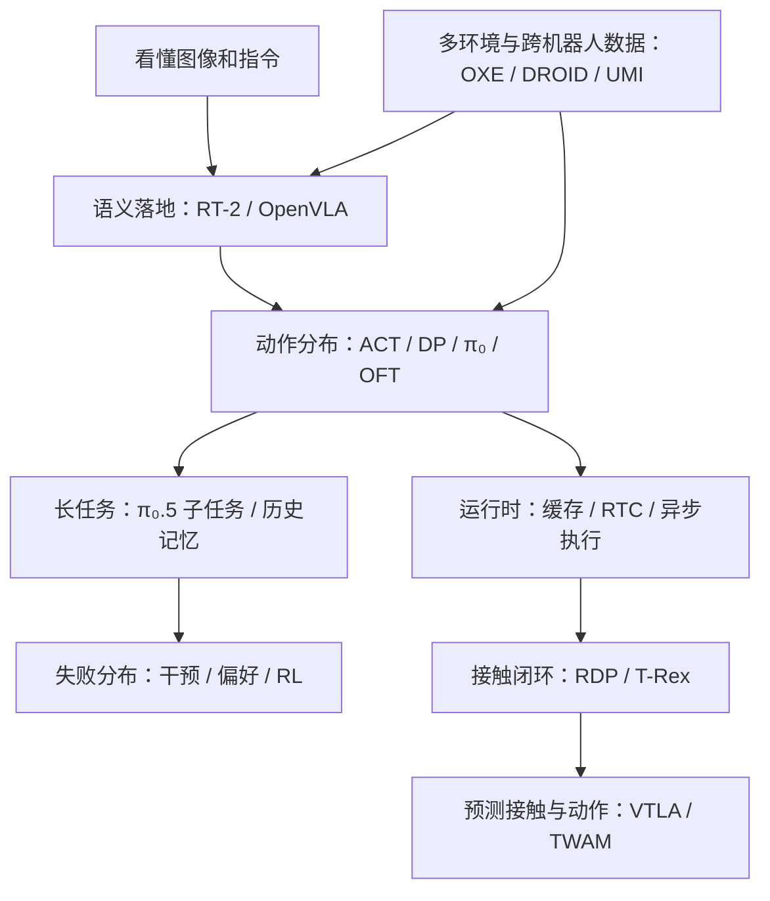

# VLA 全景综述：技术脉络、前沿与研究地图

入口：[[论文知识库]] · 配套：[[触觉机器人学习全景：感知、表征、闭环与 VLA]]

> [!abstract] 先记住这件事
> VLA 不是一条“大 VLM → 更大 VLM”的单线竞赛。它同时在补六个缺口：**理解指令、生成动作、覆盖数据、记住历史、从失败学习、及时闭环**。触觉主要补“接触状态看不见”和“纠偏来不及”，并不替代前面所有问题。

## 0. 如何使用这两篇笔记

这是帮助选论文和选问题的全景地图，不是假装逐篇复现的百科。检索截止 **2026-09-09**；近期作品单列，不把预印本当成已通过同行评审。论文表中的“导航”表示核对官方论文条目、摘要或项目页，尚不构成全文精读；核心机制沿用你已有的精读笔记，本次另重点复核 π₀、T-Rex 与 RDP 的正文及附录。网页显示的发布时间、论文初稿年份、会议年份可能不同。

推荐三种读法：

- **30 分钟建地图**：第 1、2、7、10 节，以及触觉篇第 1、7 节。
- **挑论文**：第 3、6、8 节；优先选“解释一个瓶颈”的论文，不按参数量排序。
- **准备做研究**：第 4、5、9、11 节，然后看触觉篇的实验设计。

一个口径纠正：ICRA、IROS、RSS、CoRL 是机器人领域重要会议，T-RO 是期刊，不能统称“CCF-A 会”。例如 CCF 的人工智能类列表将 ICRA 列为 B；领域影响力与 CCF 分级不是同一评价体系。正式用途以当期目录为准，本笔记按问题价值和机器人证据选文。[CCF ICRA 条目](https://www.ccf.org.cn/Academic_Evaluation/AI/zgjsjxhtjgjxshy/bl/2017-04-25/592063.shtml)

## 1. 你已经读到哪里，缺的又是什么

| 已有笔记 | 已掌握的核心问题 | 下一块最值得补的拼图 |
|---|---|---|
| [[OpenVLA]] | VLM 的 token 接口怎样接机器人动作 | RT-2 的知识迁移边界；OFT 为什么改变推理瓶颈 |
| [[π₀]] | VLM + 连续 Action Expert + Flow Matching | ACT / Diffusion Policy：为什么先生成一段动作 |
| [[π₀.5]] | 异构数据、高层子任务、离散与连续训练接口 | 数据的泛化轴、记忆、知识保护、真实 rollout 后训练 |
| [[Hy-Embodied-0.5-VLA]] | UMI 数据、MoT、历史压缩、偏好纠错和部署 | UMI 原始接口、RTC、坐标与时间对齐；拆出系统收益和模块收益 |
| [[T-Rex]]、[[FTP-1]] | 快速触觉纠偏、异构传感器统一 | RDP、Sparsh、T3、3D-ViTac 的前置问题 |
| [[N0-VTLA]]、[[N0-TWAM]] | 未来触觉、后训练、世界动作模型 | 预测何时有用？能否做动作反事实？是否仍需实时反馈？ |

你并不缺几个新模型名字；更缺“一个设计究竟在修哪一种失败”的坐标系。

## 2. 一张因果地图：六条主线，不是六代替换



*教学示意图：箭头表示问题依赖或可组合关系，不表示全部存在直接继承或引用关系。*

沿着 `S → A` 读：知道“拿杯子”不等于知道连续末端轨迹，因此需要动作生成。沿着 `C → T` 读：推理不卡顿仍可能在接触后盲走，因此需要新观测改变动作。不能把 `D → A` 误读为“任意人类视频直接变成可执行机器人标签”：动作、相机、时间和形态仍需对齐。

### 2.1 VLA、通用策略和 WAM 的边界

| 名称 | 最小理解 | 不自动具备的能力 |
|---|---|---|
| Visuomotor policy | 图像/状态到动作，可完全不含语言 | 开放词汇指令理解 |
| Language-conditioned policy | 动作受语言条件影响 | 一定使用大规模 VLM 初始化 |
| VLA | 联合处理视觉、语言与动作；本文重点是基础模型路线 | 长期记忆、可靠力控、安全约束 |
| Generalist policy | 多任务/多形态训练的策略 | 任意新机器人零样本部署 |
| WAM / World-Action Model | 联合建模未来世界表征与动作 | 可对任意候选动作做可靠反事实规划 |

“有没有大语言模型”“有没有语言输入”“有没有跨机器人数据”“有没有生成未来观测”是不同轴。DP、DP3 是重要基线，即使其原始设置不是通用 VLA，也不能从相关工作里删掉。

## 3. 经典论文：按缺口读，而不是按年代背

表内均给第一手入口；除已建立的 Vault 精读条目外，以下简评属于导航级。

| 工作 / 发表口径 | 旧方案的瓶颈 → 闪光点 | 应带走的启发与边界 |
|---|---|---|
| [RT-1](https://roboticsproceedings.org/rss19/p025.html)，RSS 2023；初稿 2022 | 单任务策略难扩展 → 多任务数据配合紧凑视觉/动作 token | 数据覆盖与实时计算共同设计；不是把互联网 VLM 直接变成控制器 |
| [RT-2](https://proceedings.mlr.press/v229/zitkovich23a.html)，CoRL 2023 | 机器人语义数据少 → VLM 与动作 token 协同微调 | 网页知识有助于语义选择；“认识新物体”不等于学会新接触技能 |
| [ACT / ALOHA](https://roboticsproceedings.org/rss19/p016.html)，RSS 2023 | 单步 BC 容易积累误差 → 一次预测动作块，配合低成本双臂采集 | 小模型和好数据仍是强基线；chunk 内的反馈刷新问题没有消失 |
| [Diffusion Policy](https://roboticsproceedings.org/rss19/p026.html)，RSS 2023 | 单峰回归平均多种合理动作 → 对动作轨迹建模条件分布 | 学分布而非均值；多步生成消耗延迟，不等于安全规划 |
| [Open X-Embodiment / RT-X](https://arxiv.org/abs/2310.08864)，ICRA 2024 | 各实验室数据割裂 → 跨形态协作数据与策略训练 | 统一接口比单纯拼文件重要；数据来源数量不等于有效迁移数量 |
| [DROID](https://www.roboticsproceedings.org/rss20/p120.html)，RSS 2024 | 实验桌背景单一 → 分布式真实场景数据采集 | 环境多样性是独立于小时数的覆盖轴 |
| [UMI](https://www.roboticsproceedings.org/rss20/p045.html)，RSS 2024 | 遥操作吞吐与形态绑定 → 手持接口采集可转移轨迹 | 采集系统定义学习问题；时间、相机及动作对齐是主角 |
| [Octo](https://www.roboticsproceedings.org/rss20/p090.html)，RSS 2024 | 多数据集观测/动作接口不同 → 可适配的通用策略架构 | 不必从超大 VLM 出发才能研究通用策略；可作为接口与数据基线 |
| [DP3](https://www.roboticsproceedings.org/rss20/p067.html)，RSS 2024 | RGB 场景变化干扰几何控制 → 紧凑点云表示 + diffusion | 3D 归纳偏置可以比增大语义模型更直接；依赖深度质量和坐标一致性 |
| [iDP3](https://github.com/YanjieZe/Improved-3D-Diffusion-Policy)，IROS 2025（作者代码页） | 进一步面向真实部署与泛化的 3D policy 改进 | 对有 3D vision 背景的人，是进入机器人策略的自然桥梁 |
| [OpenVLA](https://proceedings.mlr.press/v270/kim25c.html)，CoRL 2024；论文集 2025 | 可研究、可适配的 VLA 基线缺乏 → 开源 VLM-action 路线 | 读清 action token、反归一化、LoRA 和部署；原版不等于后来的 OFT |
| [RDT-1B](https://arxiv.org/abs/2410.07864)，2024 预印本入口 | 双臂高维动作与多源数据 → 扩规模 diffusion transformer、统一动作语义 | 数据与动作接口同样重要；不能只把贡献记成“1B 参数” |
| [π₀](https://arxiv.org/abs/2410.24164)，2024 初稿 | VLM 语义强，离散控制不够灵活 → 连续 flow action expert | 语义容量与动作采样计算解耦；不是力反馈控制器 |
| [FAST](https://www.pi.website/research/fast)，2025 官方研究入口 | 高频动作逐维 token 冗余 → 频域与序列压缩 | 训练接口可以离散、部署动作可以连续；token 数与真实时间不是同一轴 |
| [OpenVLA-OFT](https://www.roboticsproceedings.org/rss21/p017.html)，RSS 2025 | 原版串行动作解码慢 → 并行、连续动作与 chunk 的适配配方 | 不应用未经强化的旧 OpenVLA 代表整个开源 VLA 家族 |
| [UniVLA](https://www.roboticsproceedings.org/rss21/p014.html)，RSS 2025 | 非机器人视频缺动作标签 → task-centric latent action | 视频可学行为先验；latent 到机器人控制仍需 grounding |
| [π₀.5](https://arxiv.org/abs/2504.16054)，2025 初稿 | 会操作不等于能完成陌生家庭长任务 → 异构协同训练与层级推理 | “新家庭”“新物体”“新任务”必须分别定义 |

### 3.1 三组必须放在一起读

**ACT → DP → π₀ / OFT**：先看动作分布和时间结构，再看是否使用 VLM。ACT 的 chunk、DP 的分布建模、π₀ 的连续 expert、OFT 的高效适配回答不同问题，不是简单的替代链。

**OXE → DROID → UMI → HyVLA**：分别看跨形态协作、环境覆盖、采集吞吐和精密采集—训练—纠错—部署整合。若数据更多后成绩上升，仍需分清来自小时数、独立环境数、标签质量还是任务重合。

**RT-2 → OpenVLA → π₀.5 → 记忆/后训练**：语义先验帮助选对任务，但需要动作 grounding、历史状态和失败修复才能持续执行。长任务瓶颈不都能靠加一段 CoT 解决。

## 4. 从原始 pipeline 看三次关键设计转移

### 4.1 OpenVLA：让机器人动作走进语言模型接口

![[90 Attachments/OpenVLA/openvla-fig2-architecture.png]]

*Figure 2 · PDF 第 4 页 · 原论文图片。来源：[[OpenVLA]] / [原论文](https://arxiv.org/abs/2406.09246)。*

读图从左下的语言和左上的图像开始：DINOv2 / SigLIP 的特征经过 projector，进入语言模型；输出 action tokens 再反量化到机器人动作。这里“token 像词”只指计算接口相似，不意味着每个 token 具有自然语言语义。

最小例子：指令从“拿红杯”改成“拿蓝杯”，理想中首先改变目标对象，再改变末端动作。若只改语言而动作不变，可能是语言条件被忽略；若对象选对但碰撞，则是动作/几何问题，不能都叫“理解不够”。

![[90 Attachments/OpenVLA/openvla-teaching-action-token.svg]]

*已有教学图，非原论文图片。* 允许路径是连续动作经确定的量化/反量化接口落地；失败路径是把新机器人不同单位、不同控制模式的数值，未经匹配就塞进旧 action bins。模型预测 token 正确也可能执行错误。

### 4.2 π₀：让语义前缀与连续动作生成各做擅长的工作

![[90 Attachments/Pi0/pi0-fig3-framework.png]]

*Figure 3 · PDF 第 4 页 · 原论文图片，来自 [[π₀]]。*

读图依次看左侧数据、中间蓝色 VLM、绿色 action expert、右侧机器人。图像与指令提供条件，本体状态和噪声动作进入动作分支；不是语言模型逐字“写出”一条连续轨迹。

为理解生成目标，取一个教学约定：噪声为 $\epsilon$，演示动作块为 $A$，插值 $A_\tau=(1-\tau)\epsilon+\tau A$，于是目标方向为 $A-\epsilon$。这是本节的自洽记号，具体论文/代码若用相反时间方向，应整体转换，不能只改正负号。

```python
def sample_chunk(observation, instruction, state):
    # 教学伪代码；H 是轨迹长度，S 是生成迭代数，二者无关
    prefix_kv = encode_fixed_conditions(observation, instruction, state)
    action = gaussian_noise(shape=[H, action_dim])
    for tau in solver_grid:             # 同一动作块重复更新 S 次
        velocity = action_expert(action, tau, prefix_kv)
        action = action + delta_tau * velocity
    return action                      # 一次得到 H 个未来动作位置
```

![[90 Attachments/Pi0/pi0-teaching-mask.svg]]

*已有教学图，依据 π₀ 的分块注意力绘制，非原图。*

toy 三块 `P=图像/语言，S=状态，A=带噪动作`：A 允许读 P、S 和整个 A；P 不读 A；S 不读 A。这样 solver 更新 A 时，P/S 的 KV 才保持有效。禁止 `P←A` 不是为了让模型“更有因果意识”，而是确定计算依赖并保护固定前缀。块内动作互看并非偷看测试答案：它们是联合生成中的带噪变量。

![[90 Attachments/Pi0/pi0-teaching-cache.svg]]

*已有教学图，非原图。* 第一次计算前缀，之后只更新变化中的动作；相机或状态真正更新后，应重新计算相应条件，不能无限复用旧缓存。

> [!warning] 证据的准确读法
> π₀ 的多项结果按 task progress 打分，而不是全任务成败；附录还明确区分动作执行与 chunk 推理周期。它证明一种强系统配方，不意味着所有任务都可靠，也没有证明模型变大可替代接触观测。[π₀ 原文，实验与 Appendix D/E](https://www.physicalintelligence.company/download/pi0.pdf)

### 4.3 π₀.5 和 HyVLA：从单一动作头转向训练与部署链

![[90 Attachments/Pi05/pi05-fig3-pipeline.png]]

*π₀.5 Figure 3 · PDF 第 4 页 · 原论文图片。*

左边看异构数据进入离散训练接口，右边看连续 expert 的后训练与执行；推理还需要从总任务选出当前子任务。最有用的读法不是“加入了五种数据”，而是问每类数据补哪种能力。你已有笔记中，网页数据对部分总体进度指标的收益并不显著，却对 OOD 指令/高层能力更重要；这恰好说明不能只盯一个总分。[[π₀.5]]

![[90 Attachments/HyVLA/hyvla-original-pipeline.png]]

*HyVLA Figure 1 · PDF 第 2 页 · 原论文图片。*

从左到右读数据、模型和后训练，再看部署。精密 UMI 降低动作标签噪声，历史压缩补部分可观测性，FlowPRO 补失败决策边界，异步执行补推理等待。它们是互相依赖的工程链，不宜把整套收益归到 MoT 一个模块上。[[Hy-Embodied-0.5-VLA]] / [原文](https://arxiv.org/abs/2606.14409)

## 5. 必备概念：能回答这些问题才算读懂

| 概念 | 直觉与最小例子 | 最常见的误解 / 检查项 |
|---|---|---|
| BC / 分布偏移 | 演示只覆盖抓稳的状态，部署抓歪后进入未训练状态 | 离线 action MSE 小不等于 rollout 成功 |
| POMDP / belief | 外观看似相同的杯子可能已抓稳或正在滑落；历史与触觉改变对隐状态的判断 | 多帧输入不自动等于长期记忆 |
| [[Action Chunking]] | 一次预测 H 步，只执行前 k 步再看环境 | H 越长不一定越闭环；H/f 才是物理时间长度 |
| [[Flow Matching]] | 学噪声到轨迹的生成方向，容纳多峰动作 | solver 步数不是动作数；生成轨迹不是碰撞保证 |
| [[Relative EEF Action]] | 在约定参考位姿/坐标系中表示末端目标 | chunk-anchor delta 与逐步 delta 不同；位置向量相减不能代替完整 SE(3) 变换 |
| [[Mixture of Transformers]] | 不同模态走专属参数，在注意力中交换信息 | 按模态分工不等于稀疏 router MoE，也不等于自动冻结 VLM |
| [[Block-wise Causal Attention]] / [[KV Cache]] | 用依赖关系确保固定条件可复用 | attention 不可见不必然意味着所有梯度都被切断 |
| [[FAST Tokenizer]] | 压缩一段连续动作，让监督更适合 token 学习 | 不等于 π₀ 原版；不等于语言模型直接获得力学知识 |
| [[Adaptive RMSNorm]] | 用条件改变归一化后的特征 | π₀.5 的 timestep 调制不能误写成 state 调制；见 [[状态条件注入方式比较]] |
| [[UMI]] / embodiment | 将采集端与机器人关节结构适度解耦 | 仍需 IK、标定、可达性、控制模式适配 |
| SFT / DAgger / RL / preference | 分别拟合示范、补策略状态、优化回报、比较优劣动作 | reward-free 不等于 human-feedback-free；offline RL 不等于在线探索 |
| Calibration / synchronization | 图像、状态、动作对应同一真实时刻和坐标约定 | 对齐错误可能比换 backbone 更影响结果 |

### 5.1 三种“通用”一定拆开

1. **语义泛化**：新物体名称、属性、组合指令。
2. **物理泛化**：新质量、摩擦、刚度、接触几何、操作技能。
3. **形态泛化**：新机器人、自由度、控制接口与传感器。

模型在新厨房拿起已学过类别的杯子，不自动证明它能操作新锁具；换一台机械臂用 IK 执行末端轨迹，不自动证明无需适配。

## 6. 2025–2026 前沿：变化发生在哪个瓶颈

以下是精选雷达，不宣称覆盖截止日所有新投稿；“最新”不等于“最值得先读”。

| 工作 / 一手入口 | 状态与时间 | 值得关注的增量 | 证据边界 |
|---|---|---|---|
| [Knowledge Insulation](https://www.pi.website/research/knowledge_insulation) | PI 官方研究，2025-05 | 大 VLM 接新连续 expert 时，如何保护已有知识与训练稳定性 | 属于后续训练配方，不能倒写成 π₀.5 初版已具有的全部实现 |
| [Real-Time Chunking](https://www.pi.website/research/real_time_chunking) | PI 官方研究，2025-06，页面链出后续 | 生成与执行并行，约束已承诺/重叠动作，使新 chunk 接得上 | 解决过期动作与衔接；没有新增触觉就不能知道新滑移 |
| [π*₀.6 / RECAP](https://www.physicalintelligence.company/download/pistar06.pdf) | PI 技术论文入口，2025 | 从 rollout、干预和回报继续改善策略 | 奖励、数据筛选和在线反馈预算必须一起比较；本次为导航级 |
| [MEM](https://www.pi.website/research/memory) | PI 官方研究入口 | 短时视觉历史与更长期信息的分工 | 应问记忆存的是计划还是已发生事实；不能只看最长 demo |
| [π₀.7](https://arxiv.org/abs/2604.15483) | PI 技术论文，2026-04；导航级 | 多样化上下文条件，利用含失败的自主数据与非机器人数据，使策略更可引导 | 作者报告开箱与跨形态能力；仍须逐项查 unseen 定义、提示信息和部署适配，不能泛化为任意任务即用 |
| [Hy-Embodied-0.5-VLA](https://arxiv.org/abs/2606.14409) | 2026-06 预印本 | 数据—表征—动作—纠错—部署的完整链 | 原文没有完整报告模型延迟，50 Hz 执行不等于 50 Hz 大模型推理 |
| [GR00T N1](https://arxiv.org/abs/2503.14734) / [Isaac-GR00T](https://github.com/NVIDIA/Isaac-GR00T) | N1 论文 2025；检索时仓库已进入 N1.7 | 开源基础策略、适配与 NVIDIA 仿真/数据生态 | 严格区分论文版本、权重版本、机器人配置和数据许可证 |
| [DreamZero](https://dreamzero0.github.io/) | NVIDIA 相关团队，2026 技术论文 | 从未来视频与动作联合建模吸收世界模型先验 | 生成逼真不等于闭环因果准确；不等于 RoboDojo 榜单 |
| [Gemini Robotics 2](https://deepmind.google/blog/gemini-robotics-2-brings-whole-body-intelligence-to-robots/) | Google DeepMind 官方更新，2026-07-30 | 全身机器人能力及 reasoning/action 产品分工 | 官方演示/报告不是可下载同权重基线；ER 与动作模型不可混称 |
| [Rho-alpha](https://www.microsoft.com/en-us/research/story/advancing-ai-for-the-physical-world/) | Microsoft Research 官方项目介绍，2026 | 视觉、语言、动作之外引入触觉 | 开放申请/介绍不等于完整训练复现；不要补写尚未公开的实现 |
| [ReconVLA](https://arxiv.org/abs/2508.10333) / [Spatial Forcing](https://spatial-forcing.github.io/) | 2025 初稿 / 2026 研究线 | 用重建或空间辅助监督改善动作所需表征 | 对 3D 背景很相关；必须消融“额外监督”与“网络改动” |
| [LingBot-VLA](https://github.com/Robbyant/lingbot-vla) | 官方仓库，2026；本次确认 4B / Depth 权重入口 | 几何/深度增强、工程化训练适配 | 未从该仓库确认的“2.0”宣传不纳入确定事实 |
| [FailureSpot](https://arxiv.org/abs/2609.04277) | **2026-09-03 预印本，导航级** | 从动作异常弱监督与主动标注学习时间点级失败检测 | 检测不是恢复，更不是安全证明；应核对误报与检测提前量 |
| [AdaRoboVLG](https://arxiv.org/abs/2609.04096) | **2026-09-03 预印本，导航级** | 显式抓取可行性与可组合基础模型先验解耦 | 属于 VLG 抓取邻近路线，不假装是通用 VLA；提醒我们模块化仍有价值 |

### 6.1 我对趋势的判断（综合推断，不是论文定论）

模型的“知识接口”逐渐成熟，新增研究价值越来越取决于**信息是否在正确时间进入决策、训练是否覆盖失败边界、评测是否真的区分了能力**。因此，一个干净的触觉延迟实验、一个跨传感器 held-out 测试、一个可信失败检测器，可能比再造一个大模型名字更有研究价值。

## 7. 研究者与实验室地图：沿研究线追，不按名气排队

人名用于导航，不作人员职称的长期保证；联合论文归属多个组，勿把合作关系写成独占成果。这里的“港三”按港大、港中文、港科大理解，港科广另列。

| 地区 / 研究者                         | 最相关的追踪主线                                                | 第一手入口与建议                                                                                                                                                                                                            |
| -------------------------------- | ------------------------------------------------------- | ------------------------------------------------------------------------------------------------------------------------------------------------------------------------------------------------------------------- |
| 清华交叉信息院 · 许华哲                    | 3D policy、触觉硬件/闭环、RDP、DP3                               | [实验室主页](https://hxu.rocks/index.html)；优先 DP3 → RDP → ImplicitRDP                                                                                                                                                    |
| 清华交叉信息院 · 高阳                     | 通用机器人学习、视频先验、Tactile-VLA、FTP-1 合作                       | [院系主页](https://iiis.tsinghua.edu.cn/en/People/Faculty/GaoYang.htm)、[Tactile-VLA](https://arxiv.org/abs/2507.09160)；不要混同其他高校同名研究者                                                                                    |
| 清华交叉信息院 · 赵行                     | 多模态理解与具身学习                                              | [院系主页](https://iiis.tsinghua.edu.cn/rydw1/qzjs/zhaohang.htm)；跟踪组内机器人基础模型合作，具体成果以署名为准                                                                                                                                |
| 清华 · 易立                          | 3D 感知、人—物交互与具身学习                                        | [个人主页](https://ericyi.github.io/)；把 3D 几何先验与机器人控制问题连接起来                                                                                                                                                             |
| 清华 · 朱军 / 苏航团队                   | 大模型学习与双臂 diffusion policy                               | [RDT 官方代码](https://github.com/thu-ml/RoboticsDiffusionTransformer)；RDT 不应误归到赵行或卢策吾组                                                                                                                                 |
| 北大 · 王鹤 / EPIC                   | 灵巧抓取、仿真、3D 感知与操作                                        | [EPIC](https://pku-epic.github.io/)；DexGraspNet / UniDexGrasp → DexGraspNet 2.0、ScissorBot 等，先看形态与数据问题                                                                                                              |
| 上交 · 卢策吾 / MVIG                  | 操作数据、遥操作、具身策略、触觉闭环                                      | [MVIG](https://www.mvig.org/)、[RDP](https://reactive-diffusion-policy.github.io/)；RH20T、AirExo、RDP、FTP-1、ImplicitRDP 是值得串联的线                                                                                        |
| 港科广 · 李昊昂 / IRPN                 | 3D 空间表征、视觉—动作对齐、VLA                                     | [本人主页](https://sites.google.com/view/haoangli/homepage)、[学校页](https://facultyprofiles.hkust-gz.edu.cn/faculty-personal-page/LI-Haoang/haoangli)；ReconVLA、Spatial Forcing；FlowVLA 的 TRO 2026 状态此处仅按作者主页记录，未独立核验出版元数据 |
| 港大 · 罗平 / 李弘扬及 OpenDriveLab 合作   | latent action、通用策略与评测                                   | [UniVLA RSS 论文](https://www.roboticsproceedings.org/rss21/p014.html)、[OpenDriveLab](https://github.com/OpenDriveLab)；UniVLA 与 RoboDojo 分别看方法和评测                                                                     |
| 港大 · 潘佳                          | 操作、规划和触觉闭环                                              | [港大研究项目入口](https://ai.hku.hk/index.php/research/research-projects)；适合找“学习策略如何与物理控制结合”                                                                                                                               |
| 港科大 · 陈启峰及合作组                    | 视觉学习、灵巧操作、触觉 sim-to-real                                | [Rotating without Seeing](https://touchdexterity.github.io/)；与 UCSD 王小龙合作，观察触觉覆盖度和 RL                                                                                                                               |
| 港中文 · 刘云辉 / 窦琪等                  | 机器人感知、操作、空间智能、遥操作                                       | [DIH-Tele 学校论文页](https://research.cuhk.edu.hk/en/publications/dih-tele-dexterous-in-hand-teleoperation-framework-for-learning-m/)、[工程学院研究新闻](https://www3.erg.cuhk.edu.hk/erg/node/3042)；具体论文逐一核对署名，不把学校成果混成一个组     |
| Stanford / Berkeley 合作网络         | Finn、Sadigh、Song、Levine、Abbeel、Malik 等；VLA、数据、模仿学习、灵巧触觉 | 从 [OpenVLA](https://github.com/openvla/openvla)、[UMI](https://umi-gripper.github.io/)、[T-Rex](https://tactile-rex.github.io/) 作者页反查；论文发表时与现职可能不同                                                                    |
| MIT / CMU / UW / UCSD 相关团队       | Adelson 的触觉传感，Sparsh 的表征学习，Wang / Su 的仿真与灵巧操作           | [T3](https://proceedings.mlr.press/v270/zhao25c.html)、[Sparsh](https://proceedings.mlr.press/v270/higuera25a.html)、[TRO 触觉 sim-to-real](https://callmeray.github.io/tactile_sim2real_page/)                         |
| NYU / Lerrel Pinto 及合作           | 低成本数据、触觉硬件、真实机器人学习                                      | [AnySkin](https://any-skin.github.io/)；硬件可替换性也是学习泛化问题                                                                                                                                                               |
| NVIDIA / Google / PI / Microsoft | 基础策略、世界模型、数据与部署生态                                       | 跟踪第 6 节官方研究页、model card、仓库 release；不要以发布会视频代替实验协议                                                                                                                                                                   |

**建议的跟踪方法**：每个组只订阅一位主要研究者的 Scholar + 一个官方仓库/主页；看到新论文，先把它放进“数据、表征、动作、反馈、评测”之一，再决定是否精读。不是每个你关注的老师都持续做 VLA 或触觉，邻近方向同样有价值。

## 8. 开源项目：星数只是社区热度，不是效果保证

星数为 **2026-09-09 检索到的 GitHub 页面近似显示值**，可能含索引缓存，不是同步 API 快照；不适合做精确排名。未采集到的用“—”，不等于没有 star。下表的“可得”按 README/下载入口判断，未实际下载所有模型、训练或完成许可证审计。

| 项目                                                                            | 约 star | 适合做什么                     | 开放内容与注意事项                                                           |
| ----------------------------------------------------------------------------- | -----: | ------------------------- | ------------------------------------------------------------------- |
| [LeRobot](https://github.com/huggingface/lerobot)                             |  27.3k | 采集、数据格式、训练、低成本硬件工作流       | 框架 + 模型/数据生态；先锁版本，再按自身硬件选择策略                                        |
| [openpi](https://github.com/Physical-Intelligence/openpi)                     |  13.7k | π 系列微调与部署，改 action expert | 代码及部分 checkpoint；不意味着所有商业训练数据开放                                     |
| [Isaac-GR00T](https://github.com/NVIDIA/Isaac-GR00T)                          |   8.0k | NVIDIA 策略生态、适配新机器人        | 代码、权重入口、示例；N1 / N1.6 / N1.7 与依赖配置须对应                                |
| [Diffusion Policy](https://github.com/real-stanford/diffusion_policy)         |   4.5k | 建立可信 visuomotor 基线        | 训练/评测代码及任务数据入口；简单基线特别适合做触觉消融                                        |
| [RoboTwin](https://github.com/RoboTwin-Platform/RoboTwin)                     |   2.4k | 双臂仿真、数据生成与统一任务评测          | 环境、采集/评测脚本；Clean / Randomized 配置分开比较                                |
| [RDT](https://github.com/thu-ml/RoboticsDiffusionTransformer)                 |   1.7k | 双臂连续动作和跨数据集适配             | 代码、预训练模型入口；重新检查动作映射和硬件接口                                            |
| [DP3](https://github.com/YanjieZe/3D-Diffusion-Policy)                        |   1.4k | 3D 视觉到机器人操作的起步项目          | 代码、任务环境与数据说明；深度裁剪、点云坐标会改变结果                                         |
| [OpenVLA](https://github.com/openvla/openvla)                                 |      — | 可读的经典 VLA 与微调基线           | 代码、权重与数据说明；比较时同时考虑 OFT 配方                                           |
| [Hy-Embodied-0.5-VLA](https://github.com/Tencent-Hunyuan/Hy-Embodied-0.5-VLA) |      — | 接续你的 HyVLA 阅读，研究历史与部署接口   | 官方提供 UMI / RoboTwin 权重和 2K+ 小时数据子集入口，并有 RoboDojo 适配；不是全量 10K 小时数据开放 |
| [RDP](https://github.com/xiaoxiaoxh/reactive_diffusion_policy)                |      — | 低频规划 + 高频触觉闭环             | 代码/采集部署说明；硬件依赖比纯仿真 VLA 更强                                           |
| [Sparsh](https://github.com/facebookresearch/sparsh)                          |    219 | 光学触觉 encoder 与 TacBench   | 表征代码、权重/数据入口；不是完整通用动作策略                                             |
| [TACTO](https://github.com/facebookresearch/tacto)                            |    469 | 学习触觉图像渲染接口                | **已归档**，偏历史工具；渲染器不是完整可信接触动力学                                        |
| [ManiSkill-ViTac2025](https://github.com/chuanyune/ManiSkill-ViTac2025)       |     57 | 触觉仿真、融合与传感器设计基准           | 小众但相关性强；低星不代表研究价值低                                                  |

选择原则：若想验证“新模态真的有用”，先选你能控制数据、执行频率和训练预算的 DP / RDP；若想验证“大模型迁移”，再用 openpi / OpenVLA-OFT / GR00T。不要在尚未确认硬件、标定与驱动兼容前，仅按 star 买传感器或机械臂。

## 9. 榜单与网站：哪些必须知道，怎么读才不被总分带跑

### 9.1 评测导航

| 网站 / 项目 | 主要回答什么问题 | 不能据此推出什么 |
|---|---|---|
| [RoboDojo 官方仓库](https://github.com/RoboDojo-Benchmark/RoboDojo) / [榜单入口](https://robodojo-benchmark.com/leaderboard) | 多维通用策略测试，涵盖仿真/真实机器人、记忆、精度、长任务等 | 本地分数不等于官方云端认证；本次榜单网页访问超时，**未核验当前第一名** |
| [LIBERO](https://github.com/Lifelong-Robot-Learning/LIBERO) | 语言条件、多任务和不同迁移划分 | 接近满分不证明接触、真实场景或新形态泛化 |
| [CALVIN](https://calvin.cs.uni-freiburg.de/) | 连续语言指令、长序列技能组合 | 链长度指标不等于任意家庭任务能力；本次官网连接不稳定 |
| [SimplerEnv](https://simpler-env.github.io/) | 通过视觉/物理匹配，让仿真更能预测真机策略相对表现 | sim-real 排序相关性不意味着绝对成功率一致，也不覆盖全部机器人 |
| [RoboTwin](https://github.com/RoboTwin-Platform/RoboTwin) | 双臂操作与随机化场景 | 不同数据量、版本和 Clean / Randomized 结果不能直接混排 |
| [NVIDIA RoboLab](https://research.nvidia.com/labs/srl/projects/robolab/leaderboard.html) | 另一套官方机器人评测入口 | 与 RoboDojo 名称相似但不是同一榜单；不同测试协议分数不可相加 |
| [TacBench / Sparsh](https://github.com/facebookresearch/sparsh) | 触觉表示在下游感知任务上的质量 | encoder 分数高不证明闭环策略成功 |
| [ManiSkill-ViTac Challenge](https://ai-workshops.github.io/maniskill-vitac-challenge-2025/) | 触觉操作、融合、传感器设计 | 仿真表现不自动证明磨损、延迟和真实材料泛化 |

你说的“Rodojo”应是 **RoboDojo**。它的[论文](https://arxiv.org/abs/2607.04434)与官方仓库均可定位；DreamDojo 是另一类模型名字，不要混淆。

### 9.2 每周真正值得打开的入口

- [RSS Proceedings](https://www.roboticsproceedings.org/)：查原论文和发表信息。
- [PMLR](https://proceedings.mlr.press/)：查 CoRL 正式论文；会议年与论文集出版年可能不同。
- [IEEE Xplore](https://ieeexplore.ieee.org/)：T-RO、RA-L、ICRA、IROS；注意 RA-L + conference presentation 不一定是两篇独立工作。
- [arXiv cs.RO recent](https://arxiv.org/list/cs.RO/recent)：发现新作；回看 version history，不把后续版本机制写回初稿。
- [OpenReview](https://openreview.net/)：读公开评审与作者回应，区分主会、workshop 和投稿状态。
- [Google Scholar](https://scholar.google.com/) / [Semantic Scholar](https://www.semanticscholar.org/)：作者订阅、前向引用；不是机制证据本身。
- [Hugging Face Papers](https://huggingface.co/papers) + 模型/数据卡：发现与下载入口；热度不等于复现质量。
- [MIT Manipulation](https://manipulation.mit.edu/) / [Underactuated Robotics](https://underactuated.mit.edu/) / [Modern Robotics](https://modernrobotics.northwestern.edu/)：补接触、控制、运动学和规划基础的课程入口。

## 10. 跨论文比较的正确姿势

若论文 A 在 LIBERO 得分高，论文 B 在自建触觉任务成功率高，不能判断 A 比 B 强。先填下面这张实验身份证。

| 必填项                                           | 为什么会改变结论                    |
| --------------------------------------------- | --------------------------- |
| benchmark 版本、split、随机种子、是否剔除失败样本              | 避免训练测试污染和选择性统计              |
| 最终 success / progress / mean chain length 的定义 | “拿起但未放下”可能有进度分，却不是成功        |
| 每任务 trial 数、置信区间、独立任务数                        | 小样本单列差距可能只是波动               |
| 相机数量、深度、触觉、本体状态、历史长度                          | 多一种信息源本身就可能增益               |
| 预训练/微调数据、环境/物体重叠、人类干预预算                       | 不能把额外数据贡献全部算给架构             |
| 参数量、训练算力、总推理预算与重规划率                           | 强模型也可能只是每次看得更多、算得更久         |
| action normalization、坐标系、控制模式、IK / 规划器        | 策略不独立于机器人执行栈                |
| inference latency、感知到动作的 age、servo rate       | 50 Hz 电机跟踪不等于 50 Hz 接收新环境证据 |
| 失败类型、碰撞/超力次数、人工复位和恢复能力                        | 成功率以外才看得到部署成本               |

**例子**：若 T-Rex 的 RDP baseline 是各任务单独训练，而 T-Rex 有额外 mid-training 数据，比较支持的是完整训练系统效果；不能仅凭总分说“MoT 比 GRU 更好”。若 π₀ 的评分是按整理物品数量给部分分，不能将 0.8 解释成 80% 的 episode 完整成功。

## 11. 如果你现在开始做这个方向

### 11.1 建议的学习顺序

1. ACT + Diffusion Policy：能写出一个 action chunk 的训练和滚动执行。
2. OXE / DROID / UMI：能解释数据怎样变成可执行动作标签。
3. OpenVLA + OFT + π₀：区分语义主干、动作表示和采样成本。
4. π₀.5 + 你已读的 HyVLA：区分数据、层级、历史、后训练和部署。
5. DP3 / ReconVLA / Spatial Forcing：把你的 3D 经验连接到可测的控制收益。
6. RDP → T-Rex → FTP-1 / N0：进入触觉，先闭环再追基础模型规模。

### 11.2 三个更可验证的研究切口（我的建议）

| 切口 | 可检验假设 | 最小基线与关键对照 |
|---|---|---|
| 几何条件 + 触觉事件 | 接触前几何帮助对准，接触后触觉帮助恢复，二者互补 | RGB、RGB-D、RGB+touch、RGB-D+touch；保持训练量与运行时预算一致 |
| 事件驱动的历史记忆 | 记录“抓稳/释放/卡住”等真实事件，比只记语言计划更能支持长任务 | 无历史、等 token 数视觉历史、事件记忆；测试失败抓取后的错误阶段切换 |
| 延迟感知的策略适配 | 策略应对传感器时间戳与新鲜度建模，而不只拼 token | 同步输入、随机抖动、陈旧触觉、丢帧；报告恢复时延和安全代价 |

建议先做一个能够稳定复现的任务簇，不直接从零训练大 VLA。触觉篇给出更具体的对照矩阵与物理概念。

## 12. 核验状态与维护约定

- 本文总结已有 [[VLA 方法比较]]、[[训练范式地图]]、[[动作表示方法对比]]、[[数据策略对比]]，不覆盖或删除原笔记。
- 核心机制细节来源是 Vault 的原论文/精读页；新增长表多为第一手导航级，不能把整张表标成“全文已读”。
- 未完成对所有代码、权重、训练数据、许可证和真机结果的独立复现；开放状态以访问日的官方入口为准。
- 9 月新预印本只有导航级核验；不据此宣称其可靠性胜过已发表经典。
- 后续更新只需给每条补：`arXiv version / venue / code commit / checkpoint / eval split / 实际读到的证据层级`。

下一篇：[[触觉机器人学习全景：感知、表征、闭环与 VLA]]。
